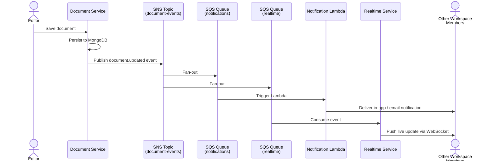

# Use Cases

User stories for CollabSpace v1. Each story is tagged with the service responsible for fulfilling it. Stories that span multiple services indicate a fan-out flow — the trigger service and downstream consumers are both listed.

**Status key:** `MVP` — required for v1 launch · `v2` — explicitly deferred

---

## Auth & Identity

| # | Story | Status | Owner |
|---|---|---|---|
| US-01 | As a new user, I want to sign up with email and password, so that I have an account to access the platform. | MVP | Auth & Workspace |
| US-02 | As a returning user, I want to log in with my credentials and receive an access token, so that I can authenticate subsequent requests. | MVP | Auth & Workspace |
| US-03 | As a logged-in user, I want to log out and have my token revoked, so that my session cannot be reused after I leave. | MVP | Auth & Workspace |

> US-03 requires token blocklisting in Redis — logout is not just a client-side token discard.

---

## Workspaces

After signing up, a user lands on a "create or join a workspace" page. Nothing else in the product is accessible without belonging to at least one workspace.

### UX Constraints

- **Empty state on signup:** A newly registered user has no workspace. The app must present a clear "Create a workspace" or "You have a pending invite" screen before any other UI is reachable. There is no meaningful home screen without workspace context.

| # | Story | Status | Owner |
|---|---|---|---|
| US-04 | As a new user, I want to create a workspace and become its admin, so that I have a space to invite my team. | MVP | Auth & Workspace |
| US-05 | As a user, I want to see a list of all workspaces I belong to along with my role in each, so that I can switch between contexts. | MVP | Auth & Workspace |
| US-06 | As an admin, I want to invite a teammate by email, so that they can join my workspace. | MVP | Auth & Workspace → Notification |
| US-07 | As an admin, I want to remove a member from the workspace, so that I can revoke access when someone leaves the team. | MVP | Auth & Workspace |
| US-08 | As an admin, I want to rename the workspace, so that the team name stays current. | MVP | Auth & Workspace |

> US-06 fans out: Auth & Workspace creates the invite record; Notification service delivers the email.

---

## Documents

| # | Story | Status | Owner |
|---|---|---|---|
| US-09 | As a workspace member, I want to create a new document in my workspace, so that I have a place to write. | MVP | Document |
| US-10 | As a workspace member, I want to edit a document and save my changes, so that the content stays up to date. Last-save-wins; if the document was updated while I was editing, I am shown a warning to review the changes. | MVP | Document |
| US-11 | As a workspace member, I want to soft-delete a document, so that it is removed from the workspace without permanent data loss. No recovery flow in v1. | MVP | Document |
| US-12 | As a workspace member, I want to see a list of all documents in my workspace, so that I can find what I need. | MVP | Document |
| US-13 | As a workspace member, I want to search for documents by title using a text substring, so that I can locate a document without knowing its exact name. | MVP | Document |

---

## Real-Time Awareness

| # | Story | Status | Owner |
|---|---|---|---|
| US-14 | As a user viewing a document, I want to see presence indicators showing which teammates are currently viewing the same document, so that I know if someone is in the same context. | MVP | Realtime |
| US-15 | As a workspace member, I want to receive a notification when any document in my workspace is updated by a teammate, so that I stay aware of changes without polling. Notifications are sent to all workspace members except the editor who made the change. | MVP | Document → SNS/SQS → Notification + Realtime |

> US-15 is the primary fan-out flow. Subscription is implicit: all workspace members are notified on every document save, minus the editor. There is no per-document watch/unwatch in v1. Document service publishes a `document.updated` event on save; SNS fans out to two SQS queues: (1) Notification service — sends in-app or email delivery; (2) Realtime service — pushes a live update to connected clients currently viewing that document.

---

## AI Assistant

| # | Story | Status | Owner |
|---|---|---|---|
| US-16 | As a workspace member, I want to ask the AI assistant a question about my workspace contents and receive an answer with citations pointing to the source documents, so that I can find institutional knowledge without searching manually. | MVP | AI Assistant |
| US-17 | As a workspace member, I want to request a summary of a specific document from the AI assistant, so that I can quickly grasp its contents without reading the full text. | MVP | AI Assistant |

> US-16 requires background indexing of all workspace documents (embeddings). The AI assistant reads from this index, not the live document store. US-17 is a simpler single-shot call with no retrieval step — a useful stepping stone to validate the AI integration before RAG is needed.

---

## Out of Scope for v1

These are deliberate exclusions. If a stakeholder requests one of these, the answer is "not in v1" — not "we haven't thought about it."

| Non-story | Reason deferred |
|---|---|
| Live collaborative editing (Google Docs-style) | Requires CRDT or OT; significant complexity for marginal value at team size 5–15 |
| Comments and threaded discussions | Comments are a subsystem (notifications, resolution state, @mentions); deferred as a unit |
| Pull-based workspace access (request to join) | Push invites cover MVP; pull access adds approval workflow complexity |
| Document version history and restore | Meaningful but requires audit log + storage strategy; soft delete covers the basic safety need |
| User profile customization (avatar, display name change) | Nice-to-have; not blocking any core flow |
| Workspace deletion | Irreversible, requires cascading deletes across services; defer until data model is stable |
| @mentions within documents | Depends on comments subsystem |
| File attachments and images in documents | Requires object storage integration (S3); deferred |
| Selective document subscription (per-document watch/unwatch) | v1 uses implicit workspace-wide notifications; per-document control adds preference storage and filtering logic |
