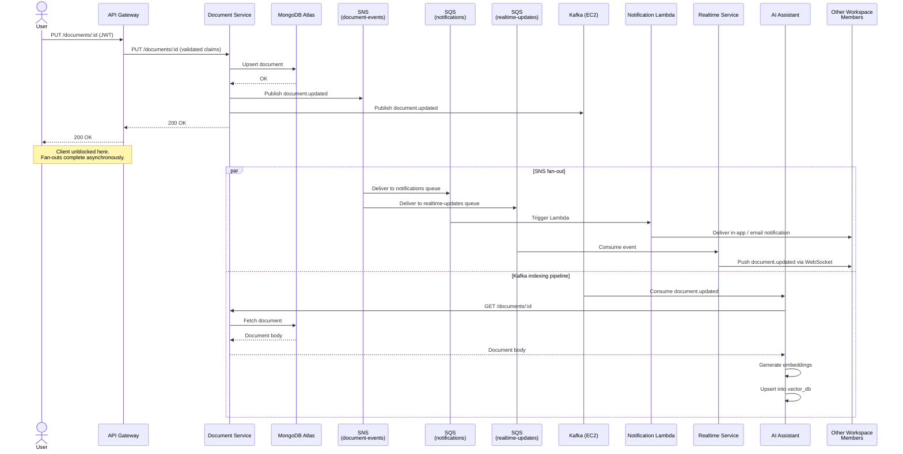

# Service Communication

This document describes how CollabSpace services communicate — both synchronous (REST, WebSocket) and asynchronous (SNS/SQS, Kafka) — and records the rationale for non-obvious patterns.

---

## Sync vs Async: The Governing Principle

The simplest way to decide whether a communication should be synchronous or asynchronous: **is this a question or an announcement?**

A **question** requires an answer. The caller needs data back, needs to know if the operation succeeded, or needs to make a decision based on the result. Questions are synchronous — REST calls through API Gateway, or WebSocket messages that expect a response. Examples: fetching a document, logging in, asking the AI assistant a question.

An **announcement** is a statement of fact about something that just happened. The publisher does not know who is listening, does not need a response, and does not care what recipients do with the information. Announcements are asynchronous — events published to SNS/SQS or Kafka. Examples: a document was saved, a member was invited.

The coupling direction matters: synchronous calls create a runtime dependency (the caller is blocked until the callee responds). Asynchronous events invert this — the publisher is unaware of its consumers and cannot be broken by them. When in doubt, prefer announcements. If the caller genuinely does not need the result of an operation to continue, it should not wait for one.

---

## Flow: User Saves a Document

This is the most complex flow in the system. A single user action triggers a synchronous write followed by two parallel async fan-outs (SNS/SQS and Kafka), with the client unblocked before either fan-out completes.



---

## Event Inventory

### Published Events

| Publisher | Event | Broker | Payload (key fields) |
|---|---|---|---|
| Document Service | `document.updated` | SNS `document-events` | `documentId`, `workspaceId`, `editorUserId`, `updatedAt` |
| Document Service | `document.updated` | Kafka `document-updates` | `documentId`, `workspaceId`, `updatedAt` |
| Auth & Workspace | `member.invited` | SNS `document-events` | `workspaceId`, `inviteeEmail`, `inviterUserId` |

> The Document Service publishes `document.updated` to both SNS and Kafka. These are independent deliveries to independent brokers — not a relay. SNS carries the fan-out to Notification and Realtime; Kafka carries the event to the AI indexing pipeline. They have different retention, ordering, and replay requirements. → ADR-003

### Consumed Events

| Consumer | Event | Source | Action |
|---|---|---|---|
| Notification Lambda | `document.updated` | SQS `notifications` | Deliver in-app or email notification to workspace members (excluding editor) |
| Notification Lambda | `member.invited` | SQS `notifications` | Deliver invite email to invitee |
| Realtime Service | `document.updated` | SQS `realtime-updates` | Push live update to WebSocket clients viewing the document |
| AI Assistant | `document.updated` | Kafka `document-updates` | Fetch document body, re-generate and upsert embeddings |

---

## Cross-Service Synchronous Call: AI Assistant → Document Service

When the AI Assistant's Kafka consumer processes a `document.updated` event, it fetches the full document body via REST before generating embeddings:

```
GET /documents/:id
Authorization: <service-to-service token>
```

**Why not direct MongoDB access?** Direct database access couples the AI Assistant to the Document Service's internal storage schema. Service ownership means each service is the sole authority over its own data store.

**Why not embed document content in the Kafka event?** The event is published on every save. Embedding the full document body — potentially tens of kilobytes — in every event would bloat the topic, increase broker storage, and force all consumers to deserialise content they may not need. The event carries only `documentId` and metadata; consumers that need content fetch it explicitly.

**Trade-off: soft dependency on Document Service availability.** If the Document Service is unavailable when the AI consumer processes a Kafka event, the fetch fails and indexing cannot complete for that document. Kafka's consumer semantics mitigate this: the offset is not committed on failure, so the event replays when the Document Service recovers. The AI index is eventually consistent — acceptable for a background concern.

**Open question: service-to-service authentication.** Options under consideration:

- **Shared secret / API key** — simple, but no caller identity and requires rotation management
- **JWT with service identity claim** — AI Assistant presents a signed JWT; Document Service validates signature and `sub` claim
- **mTLS** — mutual TLS at the network layer; strongest but most operationally complex at this scale
- **VPC-only, no app-layer auth** — rely on network isolation; simplest, but no audit trail

→ *Placeholder ADR: service-to-service authentication strategy — to be written before AI Assistant implementation.*

---

## Consistency Expectations

CollabSpace does not use distributed transactions. A document save is atomic within MongoDB; everything that follows — notifications, presence updates, AI re-indexing — is delivered asynchronously and may lag the write by seconds or, under failure, longer. This means the AI index can answer questions about a slightly stale version of a document, a notification may arrive after a user has already seen the change, and presence state may briefly show a stale viewer after a WebSocket disconnection. These are intentional trade-offs: the alternative — synchronous coupling of all five services on every save — would make the write path fragile and slow. Each service's staleness window is bounded by its retry and polling behaviour, and none of the stale-read scenarios are harmful at the team size CollabSpace targets (5–15 people).

---

## Sync API Surface

*(To be expanded during service implementation. Each service will document its REST endpoints and WebSocket events here.)*
