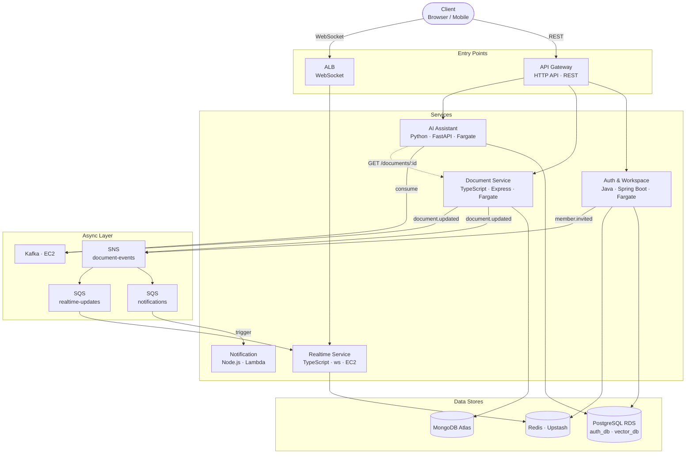

# System Overview

CollabSpace is a five-service monorepo deployed on AWS. Services communicate synchronously via REST (API Gateway) and WebSocket (ALB), and asynchronously via SNS/SQS for event fan-out and Kafka for the AI indexing pipeline. Each service owns its data store; no service reads another's database directly. The architecture is intentionally heterogeneous — language, framework, and compute choices are made per service based on fit, not consistency. See [technology-choices.md](technology-choices.md) for rationale and [docs/06-decisions/](../06-decisions/) for the ADRs behind non-obvious choices.

---

## Architecture Diagram

---

## Service Responsibilities

### Auth & Workspace

Owns the identity and access layer for the entire platform. Handles user registration, login, and logout (including JWT revocation via Redis blocklist). Also owns workspace lifecycle — creation, membership, roles, and invites. These two concerns are combined because workspace role enforcement happens inside the same token-validation path as authentication; separating them would require cross-service calls on every authenticated request. Publishes a `member.invited` event to SNS when an admin invites a new user, which the Notification service delivers as an email. → ADR-002

### Document Service

Owns the creation, retrieval, editing, and deletion of documents within a workspace. Persists documents in MongoDB Atlas; the flexible document model avoids schema migrations as the content structure evolves. On every save, publishes a `document.updated` event to both SNS (triggering the notification and realtime fan-out) and Kafka (triggering AI re-indexing). Also exposes `GET /documents/:id` as an internal endpoint consumed by the AI Assistant during indexing. → ADR-004

### Realtime Service

Owns the WebSocket layer: presence indicators (who is viewing a document right now) and live delivery of `document.updated` events to connected clients. Runs on EC2 rather than Fargate to avoid scheduler-driven host replacement during active connections. Uses Redis pub/sub as a coordination bus so that broadcast messages can reach clients connected to any instance. Consumes from the SQS realtime-updates queue; does not call other services synchronously. → ADR-005

### AI Assistant

Owns the workspace knowledge layer: background document indexing (embeddings stored in PostgreSQL with pgvector) and the conversational query interface (RAG with citations). Consumes `document.updated` events from Kafka and fetches document content via the Document Service REST API to generate embeddings — it does not read MongoDB directly. Exposes `POST /ai/ask` (RAG query) and `POST /ai/search` (semantic search) to clients via API Gateway. Uses the Claude API as its LLM backend. → ADR-003, ADR-005

### Notification Service

A stateless AWS Lambda function triggered by SQS. Delivers notifications to workspace members when a document is updated or an invite is issued. Has no database of its own; recipient lists are resolved from the event payload populated upstream by the publishing service. SQS (rather than direct SNS trigger) provides retry semantics and dead-letter queue support without custom retry logic in the function. → ADR-005

---

## Cross-Cutting Concerns

### Authentication

All client-facing requests carry a JWT issued by the Auth & Workspace service. API Gateway validates the token signature before routing to any downstream service; services can trust the decoded claims without re-validating. Internal service-to-service calls (currently only AI Assistant → Document Service) use a separate trust model — the mechanism is an open design question tracked in [service-communication.md](service-communication.md).

### Structured Logging

Every service emits structured JSON logs with a common set of fields: `service`, `level`, `timestamp`, `correlation_id`, and `trace_id`. The correlation ID is injected at the API Gateway layer and propagated through all downstream calls via request headers. This makes it possible to trace a single user action across multiple service logs. Language-specific loggers: `structlog` (Python), `pino` (TypeScript), Spring Boot's default structured logging (Java).

### Secrets and Configuration

Local development uses `.env` files (gitignored). Deployed environments read configuration from AWS SSM Parameter Store at startup — never from environment variables baked into container images, and never from Secrets Manager (cost decision; see ADR-005). All services follow the same pattern: read the SSM path on boot, fail fast if a required parameter is missing, never log the resolved value.
