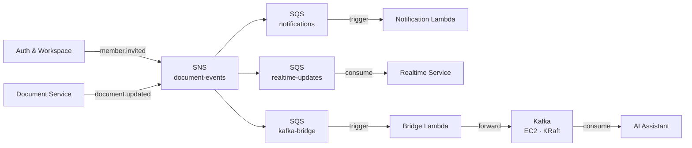

# ADR-003: Hybrid Broker Strategy — SNS/SQS + Kafka via Bridge

**Status:** Accepted  
**Date:** 2026-04-25

---

## Context

CollabSpace has two distinct async communication needs:

**Fan-out notifications.** When a document is saved, multiple consumers
(Notification Lambda, Realtime Service) must receive the event. These are
fire-and-forget: the publisher does not care about processing order, does
not need to replay past events, and consumers are stateless. Delivery
latency matters more than durability beyond the immediate window.

**AI indexing pipeline.** When a document is saved, the AI Assistant must
re-generate embeddings. This workload has different requirements: events
must be replayable (to rebuild the embedding index from scratch, or to
recover from a failed indexing run mid-document), and the consumer is
stateful (offset-tracked, long-running). Iterative AI development — where
the embedding model changes and a full rebuild is needed — makes
offset-based replay a first-class concern, not an edge case.

A single broker technology was evaluated against both use cases. The
conclusion was that no single choice is optimal across both without
accepting a meaningful cost on one side.

---

## Decision

Use a **hybrid broker strategy**: SNS/SQS for event fan-out, Kafka for the
AI indexing pipeline. The Document Service publishes to SNS only. A
**Bridge Lambda** subscribes to SNS via SQS and forwards events to Kafka,
decoupling the two broker systems at a single well-defined component.

This decision rests on two explicit pillars:

**1. Technical fit.** SNS/SQS provides native Lambda integration, fire-and-
forget delivery semantics, managed retries, dead-letter queues, and
LocalStack support — the right tool for the notification fan-out. Kafka
provides an offset-based, replayable event log with first-class consumer
group semantics — the right tool for iterative AI indexing where full
rebuilds must be triggerable on demand. SQS FIFO queues offer ordering,
but replay in SQS requires re-publishing archived messages from S3 — a
multi-step operational procedure rather than a first-class API call.
Kafka's `--from-beginning` consumer offset is operationally simpler for
the embedding-rebuild use case.

**2. Explicit learning goal.** Operating a self-managed Kafka broker on EC2
is a stated goal of this project. A team optimising purely for cost and
simplicity would choose MSK Serverless or SQS + S3 archive instead. That
trade-off is acknowledged. Kafka is here in part because running it —
topic configuration, consumer group management, offset semantics, KRaft
mode — is itself what is being learned.

### Messaging Topology

### Why the Bridge, Not Dual-Publish

An earlier design had the Document Service publishing `document.updated`
to both SNS and Kafka directly. This introduced a partial-delivery failure
mode: if the SNS publish succeeded and the Kafka publish failed (or vice
versa), the system would have no compensation mechanism and no consistent
view of which consumers had received the event.

The Bridge Lambda eliminates this by making the Document Service's publish
contract a single operation (SNS only). Cross-broker delivery is localised
to one component with well-defined retry semantics: if the bridge fails to
write to Kafka, the event accumulates in the SQS `kafka-bridge` queue and
is retried automatically. The bridge is also the exit point if Kafka is
ever replaced — see Revisit When.

**Bridge delivery guarantee:** the bridge provides at-least-once delivery
to Kafka. If the Lambda writes to Kafka but crashes before acknowledging
the SQS message, SQS will redeliver and Kafka will receive a duplicate.
The AI Assistant's indexing consumer must therefore be idempotent —
embedding upserts, not appends, keyed on `documentId`.

---

## Alternatives Considered

### SNS/SQS only (no Kafka)

Genuine strengths:
- Single broker technology, single operational concern, single LocalStack
  configuration
- SQS FIFO provides ordering; S3 event archive provides replay with
  additional tooling
- No self-managed infrastructure for messaging; SNS/SQS are fully managed
- Lower cost: SNS/SQS free tier is permanent; Kafka on EC2 consumes part
  of the 750-hour free tier

Rejected because: S3-backed replay is a multi-step operational procedure
(re-publish from archive → re-process), not a first-class API. For
iterative AI development where full index rebuilds are expected, this
friction is a recurring cost. Additionally, operating Kafka is a stated
learning goal that SQS cannot fulfil.

### Kafka only (no SNS/SQS)

Genuine strengths:
- Single broker technology
- Kafka consumer groups can replicate SNS fan-out semantics
- All events in one queryable log

Rejected because: Kafka's native Lambda trigger integration is weaker than
SQS's (requires MSK or a custom poller for self-managed Kafka); LocalStack
Kafka support is less mature than LocalStack SQS; the Notification Lambda
trigger path via SQS is simpler and more reliable than a Kafka consumer
for a stateless, fire-and-forget function.

### MSK Serverless

Would provide managed Kafka without EC2 operational overhead. Rejected on
cost grounds: MSK Serverless pricing ($0.75/hour cluster + data charges)
is incompatible with the $0–5/month target. Revisit if the self-managed
Kafka operational burden becomes unacceptable.

---

## Consequences

**Positive:**
+ Each broker is used where it fits: SNS/SQS for fire-and-forget fan-out,
  Kafka for replayable, offset-tracked AI indexing
+ Single publish from Document Service (SNS only) eliminates dual-write
  atomicity problem
+ Bridge Lambda localises cross-broker complexity to one component with
  clear retry and failure semantics
+ Kafka offset reset (`--from-beginning`) makes full embedding rebuilds a
  first-class, one-command operation during iterative AI development
+ Operating self-managed Kafka is an explicit learning goal, fulfilled

**Negative:**
− Two broker technologies mean two failure domains, two operational
  runbooks, two LocalStack configurations, two sets of monitoring
− Bridge Lambda is a required component in the critical path between
  document saves and AI indexing; its failure silently delays index
  freshness (events accumulate in SQS rather than surfacing as errors)
− Self-managed Kafka on EC2 requires manual broker maintenance: KRaft
  quorum configuration, topic retention policies, consumer group lag
  monitoring
− Bridge introduces at-least-once delivery to Kafka; AI consumer must be
  idempotent or duplicates corrupt the embedding index
− SQS `kafka-bridge` queue retention window (default 4 days, max 14 days)
  bounds how long events can accumulate during a Kafka outage before data
  loss occurs

---

## Revisit When

- Kafka operational overhead exceeds the value of first-class replay
  ergonomics (signal: embedding rebuilds become rare or are replaced by
  incremental update strategies)
- Embedding rebuilds become infrequent enough that S3 batch replay is a
  sufficient substitute for Kafka offset reset
- MSK Serverless or an equivalent managed Kafka offering enters a free-tier-
  compatible pricing model
- AI pipeline pivots to a streaming model where Kafka's continuous-consumer
  pattern becomes more strongly justified on its own merits
- Bridge SQS queue approaches retention window limits during a Kafka outage
  (signal: Kafka availability is not sufficient for the use case)
