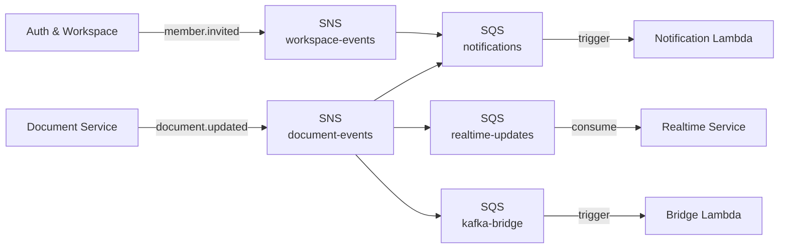

# ADR-037: Separate SNS Topic for Workspace Events

**Status:** Proposed
**Date:** 2026-07-16

---

## Context

ADR-003 established a hybrid broker strategy — SNS/SQS for fan-out notifications, Kafka for the AI indexing pipeline. Its topology diagram shows a single SNS topic, `document-events`, receiving both `document.updated` (from Document Service) and `member.invited` (from Auth & Workspace), fanning out unconditionally to three SQS queues (`notifications`, `realtime-updates`, `kafka-bridge`).

No code has been written against this topology yet. PR 9 (invite-member, `docs/03-services/auth-workspace/plans/invite-member.md`) is the first real implementation of any SNS publish from auth-workspace, so this is the first moment ADR-003's diagram is actually exercised — and the first moment its single-topic assumption gets tested against a second, genuinely different event domain.

Publishing a workspace/membership event to a topic named `document-events` is a semantic mismatch. More concretely: ADR-003 doesn't mention SNS subscription filter policies, so without them every subscriber on a shared topic receives every event type regardless of relevance. `kafka-bridge`'s sole documented purpose (ADR-003) is forwarding document events for AI embedding rebuilds — under the current diagram, it would also receive every `member.invited` message, with nothing filtering them out.

## Decision

Auth & Workspace publishes `member.invited` to a new, separate SNS topic — `workspace-events` — rather than reusing `document-events`. Each publishing service/domain gets its own topic, subscribed to independently by whichever consumers care about that domain, rather than one shared topic requiring consumer-side filtering.

`notifications` subscribes to both topics (it cares about both event families); `realtime-updates` and `kafka-bridge` subscribe only to `document-events`, since neither has any use for membership events. This doesn't change or supersede ADR-003's core broker-technology decision (SNS/SQS for fan-out, Kafka for AI indexing) — it refines the topology within that decision.

## Alternatives considered

**Keep publishing to the shared `document-events` topic, as ADR-003's diagram currently shows.** Rejected: semantic mismatch aside, every subscriber receives every event type with no filtering, which only gets worse as more event types accumulate on one topic — `kafka-bridge` and `realtime-updates` would need to inspect and discard membership events themselves, forever, for a cost avoided entirely by not sending them those events in the first place.

**Rename the shared topic to something generic (e.g. `domain-events`) and add SNS subscription filter policies** so each queue only receives the event types it wants. Rejected for now: filter policies are real operational complexity (a JSON filter policy per subscription, keyed on a message attribute every publisher must then set consistently) that isn't justified yet at this project's scale, where topics themselves are free. Worth reconsidering if the number of event-emitting services grows large enough that one-topic-per-domain becomes unwieldy — see Revisit When.

**One topic per specific event type** (e.g. `member-invited-events`, `document-updated-events`, rather than one per domain). Rejected as premature granularity — topic-per-bounded-context (auth-workspace vs. document-service) is the right grain for a project this size; splitting further multiplies topic/subscription management with no concrete need driving it.

## Consequences

**Positive:**
+ Each topic's purpose is unambiguous from its name — a new subscriber picks exactly the domain it cares about, no message-type filtering logic required.
+ `kafka-bridge` and `realtime-updates` never receive membership events they have no use for, and any future workspace-events subscriber never receives document events it doesn't care about.
+ No cost consequence — ADR-003 itself notes SNS/SQS's free tier is permanent, so a second topic doesn't move this project's $0–5/month budget.
+ Sets a clean, followable precedent for future services (AI Assistant, Realtime Service) that will eventually publish their own domain events: one topic per publishing domain, not a shared free-for-all every consumer must filter.

**Negative:**
− Two topics instead of one means two things to provision, name, and keep straight in Terraform and SSM configuration — a small increase in infrastructure surface area.
− ADR-003's own topology diagram is now stale for the topic-count aspect specifically (its SNS-vs-Kafka broker-technology decision is unaffected and still correct) — a reader consulting ADR-003 alone, without following its forward reference to this ADR, gets a subtly outdated picture of the current topology. Mitigated by adding a pointer to this ADR directly in ADR-003.
− A future consumer that needs both document and workspace events as a single unified stream (e.g. a cross-domain audit service) now needs two subscriptions instead of one — an accepted cost in exchange for cleaner per-domain separation today.

## Revisit when

- The number of services publishing their own domain events grows large enough that one-topic-per-service starts feeling like topic sprawl rather than clean separation — at that point, weigh SNS subscription filter policies on fewer, more general topics against the consumer-side filtering complexity they'd replace.
- A consumer emerges that genuinely needs cross-domain events as a single stream — this per-domain-topic split works against that consumer; a shared aggregation topic or routing layer would need evaluation.
- This ADR should move from **Proposed** to **Accepted** once auth-workspace's `member.invited` publish (PR 9) ships and is verified working end-to-end — mirroring ADR-032's own Proposed → Accepted precedent, tied to its feature's live verification rather than the ADR's write date.
